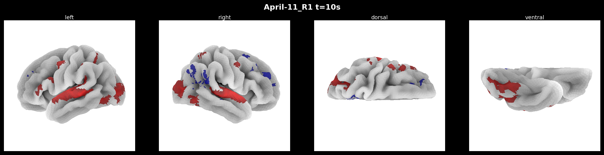
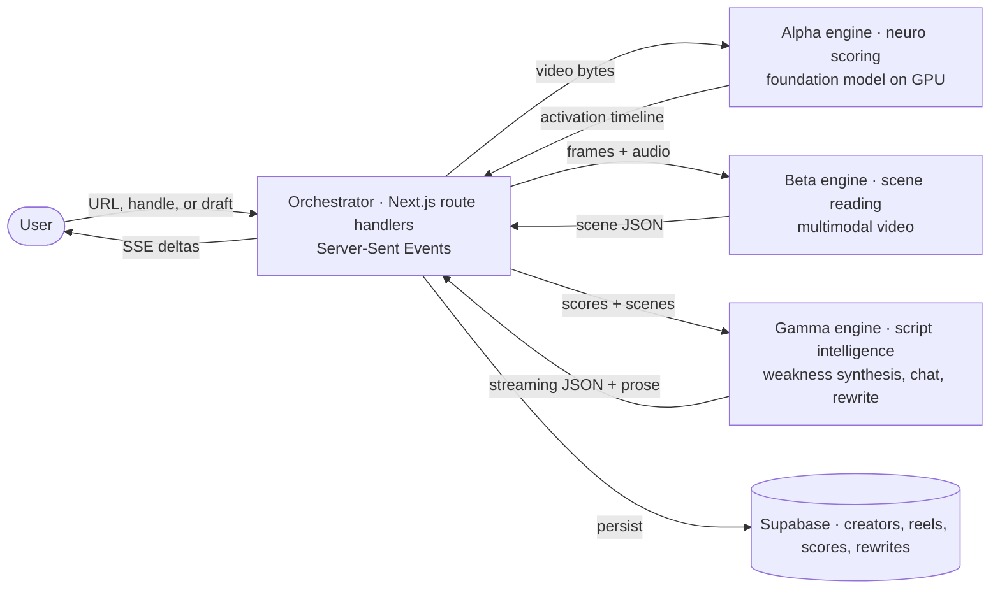
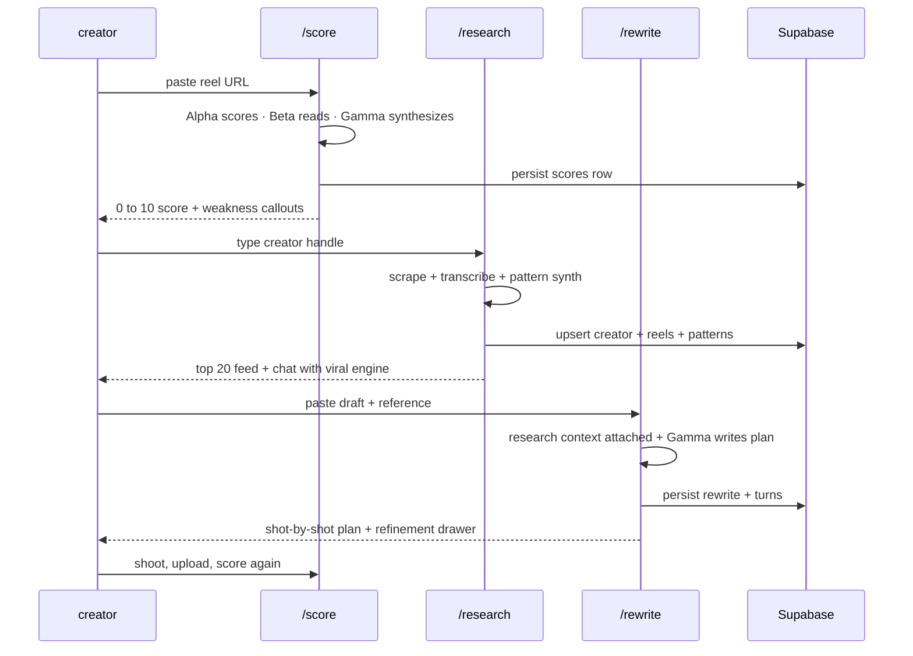

<h1 align="center">lucid</h1>

<p align="center"><em>Hack virality at the neuro level.</em></p>

<p align="center">
  
  
  
  
  
  
  
</p>

<p align="center">
  <a href="#the-thesis">Thesis</a> ·
  <a href="#the-three-engines">Engines</a> ·
  <a href="#quickstart">Quickstart</a> ·
  <a href="#architecture">Architecture</a> ·
  <a href="#database">Database</a> ·
  <a href="#deploy">Deploy</a>
</p>

---

## The thesis

A foundation model for brain activation shipped last year. Trained on a thousand hours of real fMRI scans across 720 subjects, it predicts cortical response across 20,484 vertices every second of video. The weights are public.

Most creators still ship content blind. Reward, emotion, attention, memory. Four networks that decide what gets shared and what gets scrolled past, and almost no creator tool touches any of them.

lucid is the thing that sits on top. Three systems wrapped around the model so a creator can **test** their reel, **research** what actually works for a peer creator, and **rewrite** their script in a live conversation. Then loop.

<p align="center">
  
</p>

## The three surfaces

| Surface | Verb | Input | Output |
|---|---|---|---|
| [`/score`](app/score) | Mirror | Instagram URL or reel upload | 0 to 10 neuro score, ASCII brain with live activation, scene timeline, Gamma-written weakness callouts |
| [`/research`](app/research) | Inspire | Creator handle | Top 20 reels scraped live, pattern breakdown, side chat with the viral engine anchored to real transcripts |
| [`/rewrite`](app/rewrite) | Execute | Draft script | Shot-by-shot plan. Right-side chat drawer to iterate until every shot fires |
| [`/proof`](app/proof) | Receipts | — | Scroll case study. Research paper link, Remotion render of one real inference, the systems explainer |

## The three engines

lucid is a composition, not a monolith. Each engine owns one discipline.



- **Alpha engine** the Python harness around the TRIBE v2 foundation model. Runs on an L4 GPU. Per-second activation across 20,484 cortical vertices, weighted into four engagement networks (Reward 30%, Emotion 25%, Attention 25%, Memory 20%). Lives in [`engine/`](engine/).
- **Beta engine** reads the video. Scene segmentation with transcript, dominant emotion, visual and audio tags. Returns the timeline the Gamma engine points at.
- **Gamma engine** language intelligence. Writes the weakness callouts on `/score`, the pattern analysis plus chat on `/research`, and the shot-by-shot plan plus refinement drawer on `/rewrite`.

## The loop



## Monorepo layout

```
lucid/
├── app/                    Next.js 15 App Router
│   ├── (marketing)/        landing
│   ├── score/              01 · Score
│   ├── research/           02 · Research
│   ├── rewrite/            03 · Rewrite
│   ├── proof/              the receipts page
│   └── api/                orchestrator routes
│       ├── score-live/     URL to scene timeline pipeline
│       ├── score-synth/    Gamma weakness synthesis
│       ├── scrape-creator/ Apify ingest
│       ├── chat/           streaming Gamma chat
│       └── rewrite/        structured Gamma rewrite with refinement
├── components/
│   ├── editorial/          Hero, Nav, Pullquote, Marquee, HighlightChip, Section
│   ├── surfaces/           AsciiBrain, ReelGrid, ChatPanel, ChatDrawer, ShotCard
│   └── ui/                 primitives
├── engine/                 the Alpha engine. Python, Meta TRIBE v2 wrapper
│   ├── engine/             tribe_scorer, viral_score, brain_regions, display
│   ├── brain-video/        Remotion composition for the rendered output
│   └── setup_gcp.sh        one-command GCP VM lifecycle
├── lib/
│   ├── providers/          language engine adapters + system prompts
│   ├── supabase/           client, repository, generated types
│   ├── mock.ts             authored score fallback
│   ├── mock-research.ts    authored creator research fallback
│   ├── mock-rewrite.ts     authored rewrite plan fallback
│   └── research-context.ts cross-surface sessionStorage handoff
├── supabase/
│   └── migrations/
│       └── 20260418_init.sql
├── public/proof/           the real rendered receipts
│   ├── brain-scan.mp4      Remotion output from the April 11 inference run
│   ├── networks.png, rotating-reward.gif, rotating-max.gif
│   └── score.txt           raw readout from engine.run
└── docs/
    ├── ARCHITECTURE.md     sequence diagrams, module boundaries
    └── DATABASE.md         ERD and table-by-table reference
```

## Quickstart

```bash
git clone https://github.com/Tensorboyalive/lucid.git
cd lucid
cp .env.example .env.local
set -a && source .env.local && set +a
npm install
npm run dev
```

Optional database setup:

```bash
supabase link --project-ref nszvybowalbqinsviukf
supabase db push
```

Optional Alpha engine setup on a separate GPU box:

```bash
cd engine
./setup_gcp.sh
./setup_gcp.sh run my_reel.mp4
```

## Deploy

One-click Replit import: **https://replit.com/new/github/Tensorboyalive/lucid**

Add to Replit Secrets:

| Key | Required | Powers |
|---|---|---|
| `ANTHROPIC_API_KEY` | yes | Gamma engine. Chat, rewrite, weakness synthesis |
| `ANTHROPIC_MODEL` | no | Defaults to `claude-opus-4-7`. Switch to `claude-sonnet-4-6` for snappier streaming |
| `GEMINI_API_KEY` | no | Beta engine. Scene understanding on uploaded video |
| `APIFY_TOKEN` | no | Research ingest. Live scrape of a creator feed |
| `NEXT_PUBLIC_SUPABASE_URL` | no | Database host |
| `NEXT_PUBLIC_SUPABASE_ANON_KEY` | no | Database client key |

**Zero-config demo mode.** If no keys are set every flow serves production-quality authored content so the UI never breaks on stage.

## Architecture

See [`docs/ARCHITECTURE.md`](docs/ARCHITECTURE.md) for:

- request lifecycle through the orchestrator
- sequence diagrams per surface
- streaming protocol (Server-Sent Events shape)
- error handling and the graceful-fallback matrix
- module boundaries and why

## Database

See [`docs/DATABASE.md`](docs/DATABASE.md) for:

- full ERD
- every table, column, and index with rationale
- Row Level Security posture and how to tighten it for production
- how scoring history and rewrite history power the loop

## What is real vs authored

| Surface | Live path | Authored fallback |
|---|---|---|
| `/score` from Instagram URL | yt-dlp then Apify resolver then Beta engine upload then Gamma weakness | pre-authored scene timeline |
| `/score` from file upload | Beta engine direct upload then Gamma | same authored fallback |
| `/research` scrape | live Apify actor, real thumbnails, real reel captions | cached creator profile |
| `/research` chat | streaming Gamma anchored to research context | pattern-matched replies |
| `/rewrite` initial plan | structured Gamma JSON with validated shape | pre-authored plan |
| `/rewrite` drawer chat | Gamma refinement with previous plan in scope | static plan |

The Alpha engine runs separately on GPU infrastructure, not inside the Replit container. The [`/proof`](app/proof) page surfaces a real rendered output from one inference run (two Instagram reels, 4.6 and 4.9 out of 10).

## Business model

Full editorial breakdown lives on [`/business`](app/business). In one paragraph:

A $94B short-form ad market moves every day on guesses. 2.4M creators earn over $100K and already spend $180/month on tools. None of those tools score against the brain. We sell the first one that does, at a price one viral reel repays forever.

| Tier | Price | Who | What |
|---|---|---|---|
| **Free** | $0 | The curious | 1 score / 1 research / 1 read-only rewrite per day |
| **Creator** | **$29 / mo** | Solo creators shipping weekly | Unlimited engine, history, exports, priority queue |
| **Agency** | $99 / mo | Talent agencies, MCNs, studios | Up to 10 creator profiles, per-brand network presets, team seats |
| **Enterprise** | Custom | DTC brands, studios, labs | Alpha engine API, custom cortical weights, on-prem option |

**Unit economics.** Hit rate lift 5% → 18% on creator's 170-reel backtest. One extra million-view reel at $8K brand deal ceiling pays for 275 years of Creator tier. The tool sells itself the first time it lands.

**Go to market in three phases.**

1. **Now** · founder-led drop to a 260K audience; every scored reel ships as content. Target 1,000 paying creators in 90 days, ~$29K MRR, CAC near zero.
2. **H2 2026** · 50 talent agencies at $99 via warm intros. Each agency onboards their creators. Viral coefficient > 1.
3. **2027** · Alpha engine API for DTC brands and studios. $0.25 per scored asset, 10K/mo minimum. The ad-creative vertical is 100× the creator TAM.

**North star.** $1 of creator spend returns $7 of reel revenue. Y1 target: $3.5M ARR, 10K paying creators.

## License

MIT
