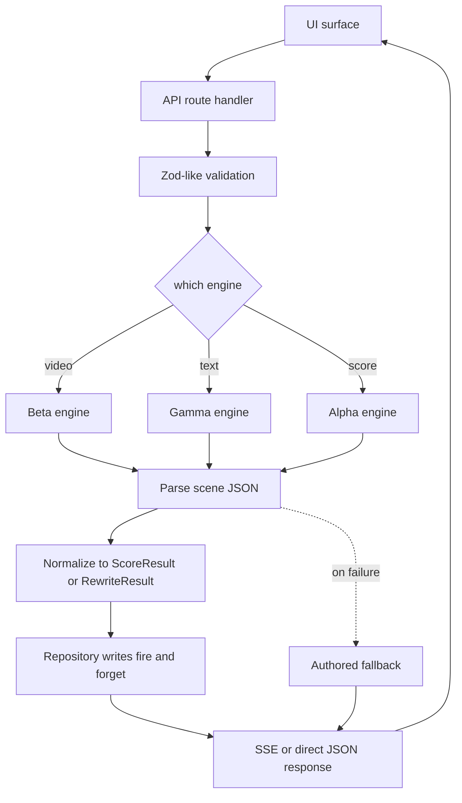
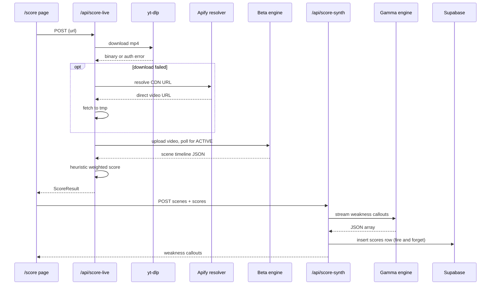
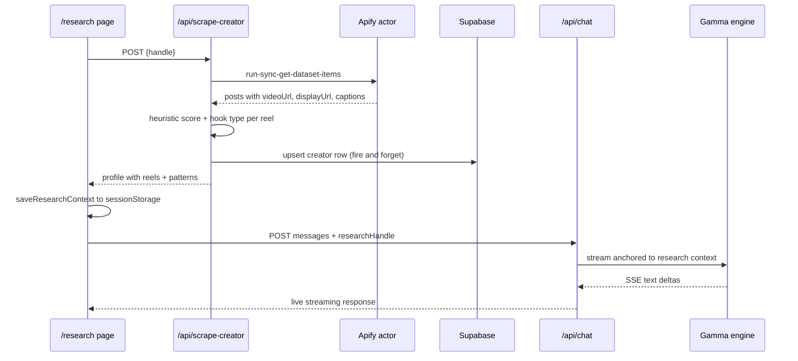
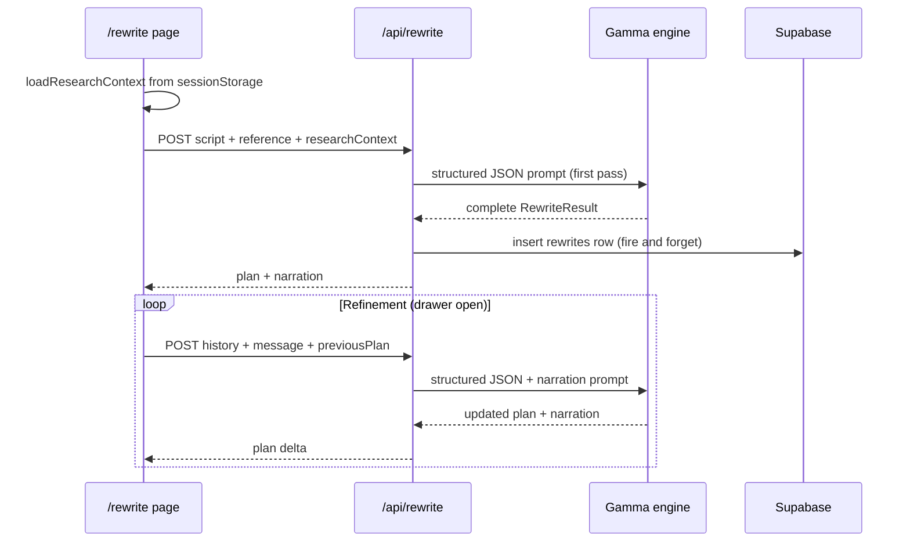

# Architecture

> A short, honest walkthrough of how lucid is wired. No buzzwords, no vendor name-dropping. The three engines are real systems with real boundaries.

## Design intent

- **One product, three engines.** The UI stays dumb. Every smart thing is an engine behind an API route.
- **Streaming by default.** The user should see Gamma forming a sentence, never wait for a full response.
- **Authored fallback for every call.** Keys missing, network dead, rate limited. The UI still looks finished.
- **Cross-surface context.** A research session informs the next rewrite. The loop is explicit.
- **The engine is not in the container.** Alpha runs on dedicated GPU infra. The web app ships cached inference.

## Module boundaries

```
┌───────────────────────────────────────────────────────────────────────────┐
│  app/                     Presentation + orchestrator                     │
│  ├── (surfaces)           Route handlers render the UI state machine      │
│  └── api/                 Thin glue that composes engine calls            │
├───────────────────────────────────────────────────────────────────────────┤
│  components/              Presentational only. No fetches. No state.      │
│  ├── editorial/           Magazine primitives                             │
│  └── surfaces/            Product widgets: score card, chat, drawer, brain│
├───────────────────────────────────────────────────────────────────────────┤
│  lib/                     Engine adapters + authored fallbacks            │
│  ├── providers/           Language engine client, prompts, stream helpers │
│  ├── supabase/            Database client, typed repository, schema types │
│  ├── mock.ts              Score authored fallback                         │
│  ├── mock-research.ts     Research authored fallback                      │
│  ├── mock-rewrite.ts      Rewrite authored fallback                       │
│  └── research-context.ts  Cross-surface handoff via sessionStorage        │
├───────────────────────────────────────────────────────────────────────────┤
│  engine/                  The Alpha engine. Python, separate deploy       │
│  ├── engine/              tribe_scorer, viral_score, brain_regions        │
│  ├── brain-video/         Remotion composition for the rendered output    │
│  └── setup_gcp.sh         One-command GCP VM lifecycle                    │
├───────────────────────────────────────────────────────────────────────────┤
│  supabase/migrations/     Schema source of truth                          │
│  public/proof/            Cached receipts from prior inference runs       │
└───────────────────────────────────────────────────────────────────────────┘
```

## The request lifecycle

Every surface follows the same shape: **UI → orchestrator → engines → persistence → streaming response**.



## Streaming protocol

Server-Sent Events. Every stream event is JSON prefixed by `data:`.

```
data: {"type":"status","data":{"label":"Downloading reel","pct":0.08}}

data: {"type":"scene","data":{...Scene}}

data: {"type":"weakness","data":{...WeaknessCallout}}

data: {"type":"result","data":{...ScoreResult}}

data: {"type":"done"}
```

The chat stream uses the same framing with `type: "text"` deltas that concatenate into the final assistant turn.

## Score pipeline



## Research pipeline



## Rewrite pipeline



## Graceful fallback matrix

| Failure | Detection | Fallback | User visible |
|---|---|---|---|
| `ANTHROPIC_API_KEY` missing | `hasAnthropic()` returns false at route entry | MOCK result + `fallback: true` | UI renders authored content |
| Claude 429 or network error | catch around `messages.create` or stream | MOCK result + error in logs | UI renders authored content |
| `GEMINI_API_KEY` missing | check at route entry | Skip Beta upload, use authored scenes | UI renders authored content |
| `gemini-2.5-pro` 404 or quota | catch, retry with `gemini-2.5-flash` | Flash output | same |
| yt-dlp Instagram auth block | non-zero exit | Apify URL actor resolver, fetch CDN bytes directly | same |
| Apify actor returns `restricted_page` | parse error field | MOCK result + descriptive `reason` | UI renders authored content |
| Supabase unreachable | `fetch` throws in repository | swallow, return null, continue | nothing, fire-and-forget |

## Security posture

- Every API route does input validation before any external call
- Max script length enforced at rewrite entry (8000 chars)
- Max message length enforced at chat entry (4000 chars)
- URL validation with `isInstagramUrl` before yt-dlp spawn
- File size limit of 80MB on the yt-dlp output
- Downloaded video deleted from tmp on success and failure
- Uploaded video deleted from the Beta engine file store after inference
- Environment variables never echoed back to the client
- Supabase Row Level Security enabled on all tables
- Demo policies allow anon reads and inserts; production hardening documented in `docs/DATABASE.md`

## Why this shape

- **Thin orchestrator, fat engines.** Each engine can be swapped without touching UI or other engines.
- **Structured output from Gamma.** JSON with a validated shape means a parse failure is a fallback, not a crash.
- **Fire-and-forget persistence.** The user never waits on the database.
- **Authored fallbacks in one place.** `lib/mock*.ts` are the single source of truth for demo content. Easy to reason about.
- **sessionStorage handoff.** Research informs rewrite without a backend round-trip. Feels instant.
- **Streaming everywhere.** Even the mock paths emit deltas on a schedule so the UI has a consistent motion vocabulary.
