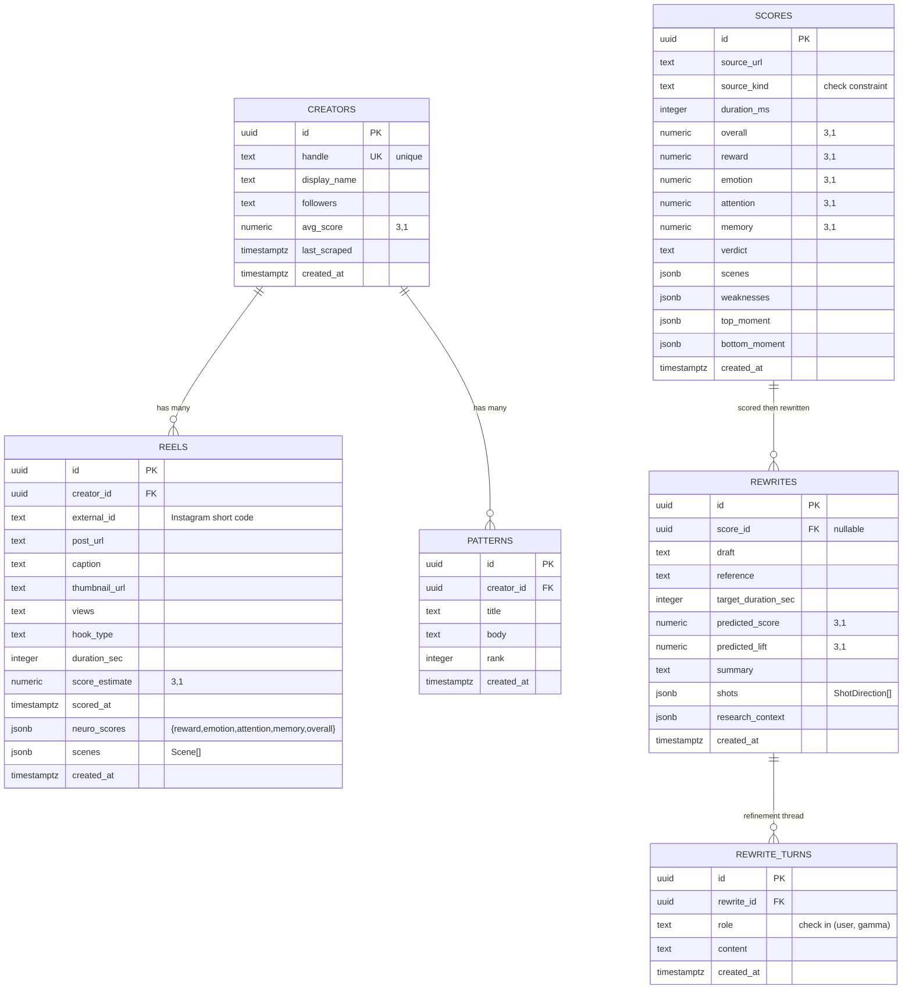

# Database

> Postgres on Supabase. Six tables, one migration file. Every surface of the product has a first-class persistence layer.

## ERD



## Tables, reasoning, and indexes

### `creators`

The normalized record for every Instagram handle we have ingested. Deduped by `handle`. Lets /research rebuild instantly on a second request.

- `avg_score` is rolling. Updated on every scrape so we can track a creator's neural profile drift over time.
- Index on `handle` supports the primary lookup.

### `reels`

One row per reel pulled from Apify. Foreign keyed back to `creators`. Captures both the ingest metadata and anything the Alpha engine produces if the reel is scored.

- `neuro_scores` JSON keeps the 4-network breakdown without proliferating columns.
- `scenes` JSON keeps the Beta engine's scene timeline. Flexible for schema evolution.
- Three indexes: `creator_id` for the feed view, `external_id` for idempotency on re-scrape, `score_estimate desc` for "top reels" queries.

### `patterns`

Gamma's pattern analysis per creator. Accumulated across runs so we can track how a creator's viral formula shifts month over month.

- `rank` lets us order patterns by Gamma's confidence without resorting by timestamp.
- Composite index `(creator_id, rank)` supports the top-N-per-creator query.

### `scores`

Every scoring run a user has triggered, whether from a URL, upload, or demo chip. This powers the "your last 10 reels" view and the improvement-over-time chart.

- `source_kind` check constraint enforces one of three enum values. Surfaces data quality issues at write time.
- `scenes`, `weaknesses`, `top_moment`, `bottom_moment` are all JSON to keep the row shape stable while the engine outputs evolve.
- Two indexes: `created_at desc` for the history feed, `overall desc` for leaderboards.

### `rewrites`

Every rewrite plan Gamma has produced. Optionally linked to the score row that triggered it (so you can navigate score → rewrite → rewrite turns).

- `shots` JSON is the core payload, validated on write by the API route.
- `research_context` JSON captures whatever /research handoff was active, so Gamma's inputs are fully reproducible later.

### `rewrite_turns`

The conversation thread when a user refines a plan in the drawer. Lets us replay a session later or fine-tune the system prompt on real interactions.

- Composite index `(rewrite_id, created_at)` supports the chronological replay.

## Row Level Security

All six tables have RLS enabled. The demo ships with permissive policies:

```sql
create policy "demo read"  on <table> for select using (true);
create policy "demo write" on <table> for insert with check (true);
```

For production, replace with auth-aware policies keyed off `auth.uid()`:

```sql
-- scores: owner reads + writes
create policy "scores owner select" on scores
  for select using (auth.uid() = user_id);

create policy "scores owner insert" on scores
  for insert with check (auth.uid() = user_id);
```

This requires adding a `user_id uuid references auth.users` column to every table with user-scoped rows and backfilling the demo rows.

## Applying the migration

Using the Supabase CLI:

```bash
supabase link --project-ref nszvybowalbqinsviukf
supabase db push
```

Or raw psql:

```bash
psql "$SUPABASE_DB_URL" -f supabase/migrations/20260418_init.sql
```

## Fire-and-forget writes

The application never blocks a request on a database write. In every API route the pattern is:

```ts
void logScore({...}).catch(() => undefined);
```

The user gets the Gamma response instantly. If the DB is dead, the request still completes cleanly. Durability is best-effort, which is the correct posture for a demo and an acceptable posture for a real product that also ships a queue.

## Why six tables and not three

A naïve design would collapse `reels`, `scores`, and `rewrites` into one denormalized "content" table. Three reasons we did not:

1. **Cardinality.** A user scores many times per reel. A reel has many rewrites. Flattening loses the relationship that powers the "every reel smarter than the last" loop.
2. **JSON blob rot.** Stashing everything in `content.payload` makes ad hoc SQL painful. Pattern queries get ugly fast.
3. **Temporal queries.** We want "scores in the last week" and "rewrites this session". Separate tables with dedicated `created_at` indexes make these trivial.

The schema is wider than a tutorial but exactly the right shape for the loop the product sells.
